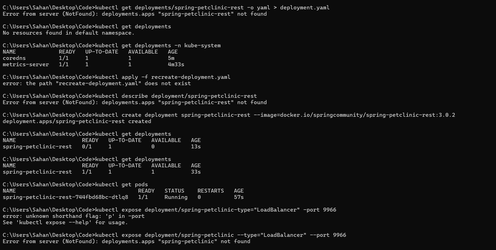

Reflection on Hello Minikube

Answer the following questions to guide your reflection:
1. Compare the application logs before and after you exposed it as a Service.
Try to open the app several times while the proxy into the Service is running.
What do you see in the logs? Does the number of logs increase each time you open the app?

Sebelom diekspos:

Setelah diekspos:

Gambar di atas merupakan percobaan saya saat melakukan pengecekan log. Iya terdapat perbedaan setelah service diekspos. Setelah service diekspos, log akan terus bertambah setiap kali aplikasi diakses. Contohnya seperti jika saya melakukan refresh pada aplikasi, maka log akan bertambah. Sebelom diekspos, log hanya berisi informasi terkati http dan udp server pada port 8080. 

2. Notice that there are two versions of `kubectl get` invocation during this tutorial section.
The first does not have any option, while the latter has `-n` option with value set to
`kube-system`.
What is the purpose of the `-n` option and why did the output not list the pods/services that you
explicitly created?
> Hint: Do some reading about [Namespace in Kubernetes
documentation](https://kubernetes.io/docs/concepts/overview/working-with-objects/namespaces
/).

`-n` option digunakan untuk menentukan namespace yang akan diakses. Namespace adalah cara untuk memisahkan resource pada kubernetes. Jadinya, kita bisa mengakses resource pada namespace tertentu. Jika tidak menggunakan `-n` option, maka akan mengakses default namespace. Jadi, resource yang diakses adalah resource pada default namespace saja. 

Reflection on Rolling Update & Kubernetes Manifest File

1. What is the difference between Rolling Update and Recreate deployment strategy?
> Hint: Read the Deployments documentation.

Rolling Update adalah strategi update yang dilakukan secara bertahap. Artinya, ketika kita melakukan update, maka pod yang lama akan dihapus dan digantikan dengan pod yang baru. Hal ini dilakukan secara bertahap, sehingga aplikasi tetap berjalan dan tidak ada downtime. Sedangkan Recreate deployment strategy adalah strategi update yang dilakukan dengan cara menghapus semua aplikasi yang lama, kemudian melakukan redeploy aplikasi yang baru. Hal ini menyebabkan adanya downtime pada aplikasi.

2. Try deploying the Spring Petclinic REST using Recreate deployment strategy and document
your attempt.

3. Prepare different manifest files for executing Recreate deployment strategy.

File recreate-deployment.yaml ini saya buat dengan memodifikasi strategy deployment.yaml menjadi Recreate

4. What do you think are the benefits of using Kubernetes manifest files? Recall your experience
in deploying the app manually and compare it to your experience when deploying the same app
by applying the manifest files (i.e., invoking `kubectl apply -f` command) to the cluster.

Kubernetes manifest files memudahkan kita dalam melakukan deployment aplikasi. Kita dapat mengautomasi deployment sehingga menurunkan risiko human error. Dengan menggunakan manifest files, kita dapat melakukan deployment dengan mudah dan cepat. Kita hanya perlu menjalankan perintah `kubectl apply -f` untuk melakukan deployment. Sedangkan jika melakukan deployment manual, kita harus melakukan banyak langkah dan memerlukan waktu yang lebih lama.
